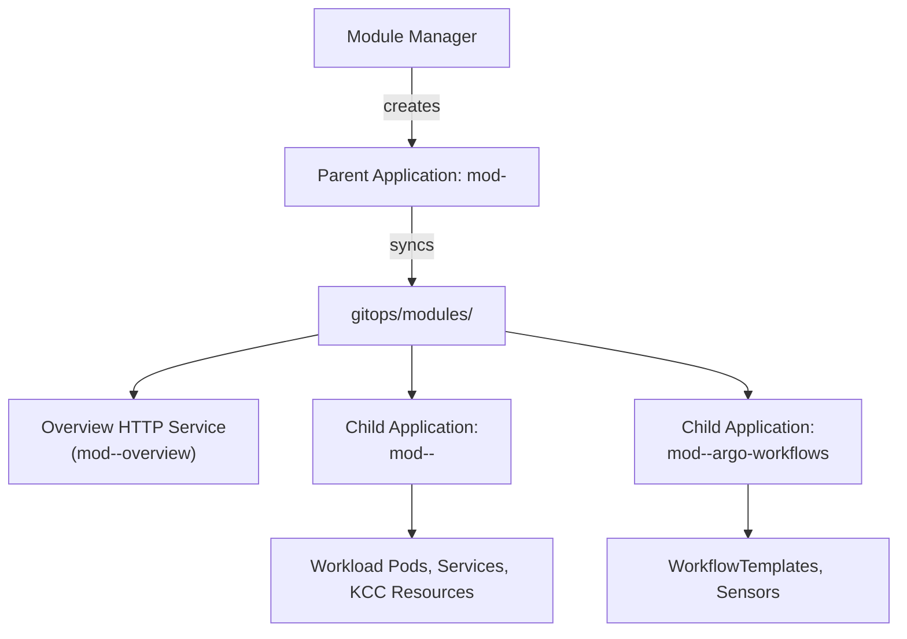

<!-- Copyright (c) 2026 Accenture, All Rights Reserved. -->

# Module Architecture & Folder Structure

This guide explains the architectural patterns, directory layout, and manifest conventions used for modules in Horizon SDV.

---

## 0. Repository Architecture & Licensing Rules

When designing and placing components in the repository, adhere to these mandatory rules:

| Component Type | Target Repository Location | Licensing Requirement | Description |
| :--- | :--- | :--- | :--- |
| **All Modules (Core, Workload, Partner)** | `gitops/modules/<module-name>/` | Apache 2.0 | **All modules (including partner contributions) must reside here**. The legacy `workloads/` directory is deprecated and there is no top-level `partner/` folder. |
| **Non-Apache 2.0 Dependencies** | `third_party/<component_name>/` | Compatible FOSS / Vendor terms | Dedicated folder for any third-party code, tools, or dependencies that cannot be licensed under Apache 2.0. |
| **Platform Infrastructure** | `terraform/modules/<module-name>/` | Apache 2.0 | Foundational Terraform IaC modules (VPC networking, GKE cluster, KMS). |

---

## 1. The App-of-Apps Pattern

Horizon SDV employs the **Argo CD App-of-Apps pattern** to manage modules. When a module is enabled via the Developer Portal or Module Manager API, Module Manager generates a root parent Argo CD `Application` (`mod-<moduleName>`).

This parent Application synchronizes the parent Helm chart located at `gitops/modules/<moduleName>`. The parent chart renders:
1. **Child Argo CD Applications**: One or more child `Application` resources that point to subcharts within the module directory (e.g., `<child-app>/` or `argo-workflows/`).
2. **In-Cluster Module Overview**: A lightweight `ConfigMap`, `Deployment`, and `Service` running an Nginx micro-server that serves the module's HTML documentation (`portal/overview.html`) directly to the Developer Portal.



---

## 2. Standard Directory Layout

Every module placed in `gitops/modules/<module-name>/` follows this directory structure:

```text
gitops/modules/<module-name>/
├── Chart.yaml                               # Parent chart metadata
├── README.md                                # Human-readable documentation
├── values.yaml                              # Module Manager injection schema & defaults
├── portal/
│   └── overview.html                        # HTML rendered in the Developer Portal
├── templates/
│   ├── module-overview-http.yaml            # Overview Nginx Deployment + Service + ConfigMap
│   ├── application-<child-app>.yaml         # Child Argo CD Application for workloads / KCC
│   └── application-argo-workflows.yaml      # Child Argo CD Application for Argo Workflows
├── <child-app>/                             # Child Helm chart for workloads & KCC
│   ├── Chart.yaml
│   ├── values.yaml
│   └── templates/
│       ├── deployment.yaml
│       ├── service.yaml
│       ├── gateway-<child-app>.yaml         # HTTPRoute and HealthCheckPolicy
│       ├── network-policies.yaml
│       └── kcc-<resource>.yaml              # Google Cloud Config Connector manifests
└── argo-workflows/                          # Child Helm chart for pipelines
    ├── Chart.yaml
    ├── values.yaml
    └── templates/
        ├── workflowtemplates.yaml           # Argo WorkflowTemplates
        └── sensors.yaml                     # Argo Events Sensors
```

---

## 3. Parent Chart Anatomy

### `Chart.yaml`

The parent `Chart.yaml` defines the module identity and version:

```yaml
apiVersion: v2
name: sample-module
description: Sample Horizon SDV module with KCC and Argo Workflows
version: 0.1.0
type: application
appVersion: "0.1.0"
```

### `values.yaml`

Module Manager injects environmental parameters and dependency states into the parent chart at runtime:

```yaml
# Injected dynamically by Module Manager when enabling
moduleName: ""
moduleManagerNamespace: module-manager

# Argo CD configuration
argocd:
  namespace: argocd
  project: horizon-sdv

# Source repository URL and target revision
repo:
  url: ""
  revision: HEAD

# Namespaces and overview service
helloWorldNamespace: sample-module-hello
overviewServiceName: mod-sample-overview
overviewNamespace: sample-module-hello

# Public Gateway route path
helloWorld:
  rootPath: /hello-world

# Cluster-wide environment config injected by Module Manager
# (contains projectID, region, zone, domain, namespacePrefix, etc.)
config: {}

# Soft feature flags injected dynamically based on enabled dependencies
softFeaturesEnabled: {}
```

---

## 4. Declaring Child Applications

Child applications are declared as `argoproj.io/v1alpha1` `Application` resources in the parent `templates/` folder.

### Workload / Application Manifest (`templates/application-hello-world.yaml`)

```yaml
apiVersion: argoproj.io/v1alpha1
kind: Application
metadata:
  name: mod-{{ .Values.moduleName }}-hello-world
  namespace: {{ .Values.argocd.namespace }}
  labels:
    app.kubernetes.io/name: {{ .Values.moduleName }}
    horizon-sdv.io/module: {{ .Values.moduleName }}
    horizon-sdv.io/app-role: child
    horizon-sdv.io/expose: "true"
    horizon-sdv.io/module-manager-managed: "true"
  annotations:
    horizon-sdv.io/portal-url: {{ .Values.helloWorld.rootPath | quote }}
    horizon-sdv.io/portal-title: "Hello World"
    horizon-sdv.io/portal-id: hello-world
  finalizers:
    - resources-finalizer.argocd.argoproj.io
spec:
  project: {{ .Values.argocd.project }}
  source:
    repoURL: {{ .Values.repo.url | quote }}
    targetRevision: {{ .Values.repo.revision | quote }}
    path: gitops/modules/sample-module/hello-world
    helm:
      values: |
        namespace: {{ .Values.helloWorldNamespace }}
        rootPath: {{ .Values.helloWorld.rootPath | quote }}
        gcpProjectId: {{ .Values.config.projectID | quote }}
        parentModuleName: {{ .Values.moduleName | quote }}
        config:
{{ .Values.config | toYaml | nindent 10 }}
  destination:
    server: https://kubernetes.default.svc
    namespace: {{ .Values.helloWorldNamespace }}
  syncPolicy:
    syncOptions:
      - CreateNamespace=true
    automated: {}
```

### Argo Workflows Child Manifest (`templates/application-argo-workflows.yaml`)

```yaml
apiVersion: argoproj.io/v1alpha1
kind: Application
metadata:
  name: mod-{{ .Values.moduleName }}-argo-workflows
  namespace: {{ .Values.argocd.namespace }}
  labels:
    app.kubernetes.io/name: {{ .Values.moduleName }}
    horizon-sdv.io/module: {{ .Values.moduleName }}
    horizon-sdv.io/app-role: child
    horizon-sdv.io/module-manager-managed: "true"
  finalizers:
    - resources-finalizer.argocd.argoproj.io
spec:
  project: {{ .Values.argocd.project }}
  source:
    repoURL: {{ .Values.repo.url | quote }}
    targetRevision: {{ .Values.repo.revision | quote }}
    path: gitops/modules/sample-module/argo-workflows
    helm:
      values: |
        workflowNamespace: {{ .Values.config.namespacePrefix }}workflows
        eventsNamespace: {{ .Values.config.namespacePrefix }}argo-events
        parentModuleName: {{ .Values.moduleName | quote }}
        softFeaturesEnabled:
{{ .Values.softFeaturesEnabled | toYaml | nindent 10 }}
  destination:
    server: https://kubernetes.default.svc
    namespace: {{ .Values.config.namespacePrefix }}workflows
  syncPolicy:
    syncOptions:
      - CreateNamespace=true
    automated: {}
```

---

## 5. Developer Portal Overview Service (`templates/module-overview-http.yaml`)

Every module includes a micro-webserver that serves `portal/overview.html` to the Developer Portal backend:

```yaml
apiVersion: v1
kind: ConfigMap
metadata:
  name: {{ .Values.overviewServiceName }}-html
  namespace: {{ .Values.overviewNamespace }}
  labels:
    app.kubernetes.io/name: module-overview
    horizon-sdv.io/module: {{ .Values.moduleName | quote }}
data:
  index.html: |-
{{ .Files.Get "portal/overview.html" | nindent 4 }}
---
apiVersion: apps/v1
kind: Deployment
metadata:
  name: {{ .Values.overviewServiceName }}
  namespace: {{ .Values.overviewNamespace }}
  labels:
    app.kubernetes.io/name: module-overview
    horizon-sdv.io/module: {{ .Values.moduleName | quote }}
spec:
  replicas: 1
  selector:
    matchLabels:
      app.kubernetes.io/name: module-overview
      horizon-sdv.io/module: {{ .Values.moduleName | quote }}
  template:
    metadata:
      labels:
        app.kubernetes.io/name: module-overview
        horizon-sdv.io/module: {{ .Values.moduleName | quote }}
    spec:
      containers:
        - name: nginx
          image: {{ .Values.config.nginx.image }}:{{ .Values.config.nginx.tag }}
          ports:
            - containerPort: 80
              name: http
          volumeMounts:
            - name: html
              mountPath: /usr/share/nginx/html
              readOnly: true
          resources:
            requests:
              cpu: 5m
              memory: 16Mi
            limits:
              memory: 64Mi
      volumes:
        - name: html
          configMap:
            name: {{ .Values.overviewServiceName }}-html
---
apiVersion: v1
kind: Service
metadata:
  name: {{ .Values.overviewServiceName }}
  namespace: {{ .Values.overviewNamespace }}
  labels:
    app.kubernetes.io/name: module-overview
    horizon-sdv.io/module: {{ .Values.moduleName | quote }}
spec:
  type: ClusterIP
  selector:
    app.kubernetes.io/name: module-overview
    horizon-sdv.io/module: {{ .Values.moduleName | quote }}
  ports:
    - name: http
      port: 80
      targetPort: http
```
