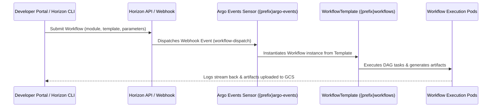

<!-- Copyright (c) 2026 Accenture, All Rights Reserved. -->

# Argo Workflows & Argo Events in Horizon Modules

This guide explains how to define, expose, and trigger **Argo Workflows** and **Argo Events Sensors** within a Horizon SDV module.

---

## 1. Pipeline Naming Conventions & Defaults

By default, every Horizon SDV module should provide **two standard pipeline types**:
1. **Initialization Pipeline (`<module-name>-init`)**: Prepares credentials, verifies KCC cloud resources, sets up buckets/topics, initializes databases, downloads seed assets, or warms build caches.
2. **Execution Pipeline (`<module-name>-execute` or `<module-name>-smoke-test`)**: Runs the main workload, compilation, test suite, or data processing flow and publishes output artifacts.

### Naming Conventions in Existing Modules

| Module Name | Initialization Pipeline (`-init` / setup) | Execution Pipeline (`-execute` / smoke-test) | Webhook Sensor (`webhook-`) |
| :--- | :--- | :--- | :--- |
| `sample-module` | `sample-init` | `sample-smoke-test` / `sample-smoke-test-alt` | `webhook-sample-smoke-test` |
| `sample-hard-module` | `sample-hard-init` | `sample-hard-smoke-test` / `sample-hard-smoke-test-alt` | `webhook-sample-hard-smoke-test` |
| `sample-soft-module` | `sample-soft-init` | `sample-soft-smoke-test` | `webhook-sample-soft-smoke-test` |
| `storage-gcs-module` | `storage-gcs-module-internal` | `storage-gcs-upload` (`upload`, `resumable-upload`) | Managed via internal API / CRDs |
| `workloads-common` | `prepare-pipeline-git-creds` | `common-docker-image-build` | `webhook-prepare-pipeline-git-creds` |

---

## 2. Architecture Overview



### Namespace Conventions
- **WorkflowTemplates & Running Workflows**: Deployed to `{{ .Values.workflowNamespace }}` (resolves to `{namespacePrefix}workflows`).
- **Argo Events Sensors**: Deployed to `{{ .Values.eventsNamespace }}` (resolves to `{namespacePrefix}argo-events`).
- **Service Accounts**:
  - `workflow-executor`: ServiceAccount running workflow steps.
  - `sensor-submit-workflow`: Argo Events ServiceAccount with RBAC to submit workflows.

---

## 3. Writing Default `WorkflowTemplate` Manifests

Manifest: `gitops/modules/<module-name>/argo-workflows/templates/workflowtemplates.yaml`

```yaml
apiVersion: argoproj.io/v1alpha1
kind: WorkflowTemplate
metadata:
  name: {{ .Values.parentModuleName }}-init
  namespace: {{ .Values.workflowNamespace }}
  labels:
    app.kubernetes.io/name: init
    horizon-sdv.io/expose: "true"         # Exposes template in Developer Portal & CLI
    horizon-sdv.io/module: {{ .Values.parentModuleName }}
  annotations:
    argocd.argoproj.io/sync-wave: "7"     # Applied in sync wave 7
spec:
  entrypoint: run-init
  serviceAccountName: workflow-executor
  arguments:
    parameters:
      - name: horizonSubmittedFrom
        value: ""
        description: "Source identifier (e.g., developer-portal, horizon-cli)"
      - name: initTarget
        value: "default"
        description: "Target environment or seed dataset to initialize"
  templates:
    - name: run-init
      dag:
        tasks:
          - name: log-parameters
            template: log-parameters
          - name: setup-resources
            template: setup-resources
            depends: log-parameters
    - name: log-parameters
      container:
        image: alpine:3.19
        command: [sh, -c]
        args:
          - |
            echo "WorkflowTemplate: {{ .Values.parentModuleName }}-init"
            echo "Submitted From: {{ "{{workflow.parameters.horizonSubmittedFrom}}" }}"
            echo "Target: {{ "{{workflow.parameters.initTarget}}" }}"
            echo "Initialization started at $(date -u +%Y-%m-%dT%H:%M:%SZ)"
    - name: setup-resources
      container:
        image: alpine:3.19
        command: [sh, -c]
        args:
          - |
            echo "Initializing resources for {{ .Values.parentModuleName }}..."
            echo "Initialization successful - $(date -u +%Y-%m-%dT%H:%M:%SZ)" > /tmp/init-status.txt
            cat /tmp/init-status.txt
      outputs:
        artifacts:
          - name: init-status
            path: /tmp/init-status.txt
---
apiVersion: argoproj.io/v1alpha1
kind: WorkflowTemplate
metadata:
  name: {{ .Values.parentModuleName }}-execute
  namespace: {{ .Values.workflowNamespace }}
  labels:
    app.kubernetes.io/name: execute
    horizon-sdv.io/expose: "true"         # Exposes template in Developer Portal & CLI
    horizon-sdv.io/module: {{ .Values.parentModuleName }}
  annotations:
    argocd.argoproj.io/sync-wave: "7"     # Applied in sync wave 7
spec:
  entrypoint: run-execution
  serviceAccountName: workflow-executor
  arguments:
    parameters:
      - name: horizonSubmittedFrom
        value: ""
        description: "Source identifier (e.g., developer-portal, horizon-cli)"
      - name: executionEnv
        value: "test"
        description: "Target execution environment"
      - name: buildId
        value: "build-001"
        description: "Execution run identifier"
  templates:
    - name: run-execution
      dag:
        tasks:
          - name: log-parameters
            template: log-parameters
          - name: run-workload
            template: run-workload
            depends: log-parameters
    - name: log-parameters
      container:
        image: alpine:3.19
        command: [sh, -c]
        args:
          - |
            echo "WorkflowTemplate: {{ .Values.parentModuleName }}-execute"
            echo "Submitted From: {{ "{{workflow.parameters.horizonSubmittedFrom}}" }}"
            echo "Environment: {{ "{{workflow.parameters.executionEnv}}" }}"
            echo "Build ID: {{ "{{workflow.parameters.buildId}}" }}"
            echo "Execution started at $(date -u +%Y-%m-%dT%H:%M:%SZ)"
    - name: run-workload
      container:
        image: alpine:3.19
        command: [sh, -c]
        args:
          - |
            echo "Executing workload for {{ .Values.parentModuleName }}..."
            mkdir -p /tmp/output
            echo "Execution completed successfully at $(date -u +%Y-%m-%dT%H:%M:%SZ)" > /tmp/output/result.txt
            tar -czf /tmp/output/execution-artifact.tgz -C /tmp/output result.txt
            cat /tmp/output/result.txt
      outputs:
        artifacts:
          - name: result
            path: /tmp/output/result.txt
          - name: execution-artifact
            path: /tmp/output/execution-artifact.tgz
```

---

## 4. Writing Argo Events `Sensor` Manifests

Manifest: `gitops/modules/<module-name>/argo-workflows/templates/sensors.yaml`

```yaml
apiVersion: argoproj.io/v1alpha1
kind: Sensor
metadata:
  name: webhook-{{ .Values.parentModuleName }}-init
  namespace: {{ .Values.eventsNamespace }}
  annotations:
    argocd.argoproj.io/sync-wave: "8"     # Applied after WorkflowTemplates
spec:
  eventBusName: default
  template:
    serviceAccountName: sensor-submit-workflow
  dependencies:
    - name: webhook-dep
      eventSourceName: webhook
      eventName: workflow-dispatch
      filters:
        data:
          - path: body.workflowTemplateName
            type: string
            value:
              - "{{ .Values.parentModuleName }}-init"
  triggers:
    - template:
        name: submit-init
        argoWorkflow:
          operation: submit
          source:
            resource:
              apiVersion: argoproj.io/v1alpha1
              kind: Workflow
              metadata:
                generateName: webhook-{{ .Values.parentModuleName }}-init-
                namespace: {{ .Values.workflowNamespace }}
              spec:
                workflowTemplateRef:
                  name: {{ .Values.parentModuleName }}-init
                arguments:
                  parameters:
                    - name: horizonSubmittedFrom
                    - name: initTarget
          parameters:
            - src:
                dependencyName: webhook-dep
                dataKey: body.horizonSubmittedBy
              dest: metadata.annotations.horizon-sdv\.io/submitted-by
            - src:
                dependencyName: webhook-dep
                dataKey: body.horizonSubmittedFrom
              dest: metadata.labels.horizon-sdv\.io/submitted-from
            - src:
                dependencyName: webhook-dep
                dataKey: body.horizonSubmittedFrom
              dest: spec.arguments.parameters.0.value
            - src:
                dependencyName: webhook-dep
                dataKey: body.initTarget
              dest: spec.arguments.parameters.1.value
---
apiVersion: argoproj.io/v1alpha1
kind: Sensor
metadata:
  name: webhook-{{ .Values.parentModuleName }}-execute
  namespace: {{ .Values.eventsNamespace }}
  annotations:
    argocd.argoproj.io/sync-wave: "8"     # Applied after WorkflowTemplates
spec:
  eventBusName: default
  template:
    serviceAccountName: sensor-submit-workflow
  dependencies:
    - name: webhook-dep
      eventSourceName: webhook
      eventName: workflow-dispatch
      filters:
        data:
          - path: body.workflowTemplateName
            type: string
            value:
              - "{{ .Values.parentModuleName }}-execute"
  triggers:
    - template:
        name: submit-execute
        argoWorkflow:
          operation: submit
          source:
            resource:
              apiVersion: argoproj.io/v1alpha1
              kind: Workflow
              metadata:
                generateName: webhook-{{ .Values.parentModuleName }}-execute-
                namespace: {{ .Values.workflowNamespace }}
              spec:
                workflowTemplateRef:
                  name: {{ .Values.parentModuleName }}-execute
                arguments:
                  parameters:
                    - name: horizonSubmittedFrom
                    - name: executionEnv
                    - name: buildId
          parameters:
            - src:
                dependencyName: webhook-dep
                dataKey: body.horizonSubmittedBy
              dest: metadata.annotations.horizon-sdv\.io/submitted-by
            - src:
                dependencyName: webhook-dep
                dataKey: body.horizonSubmittedFrom
              dest: metadata.labels.horizon-sdv\.io/submitted-from
            - src:
                dependencyName: webhook-dep
                dataKey: body.horizonSubmittedFrom
              dest: spec.arguments.parameters.0.value
            - src:
                dependencyName: webhook-dep
                dataKey: body.executionEnv
              dest: spec.arguments.parameters.1.value
            - src:
                dependencyName: webhook-dep
                dataKey: body.buildId
              dest: spec.arguments.parameters.2.value
```

---

## 5. Submitting & Inspecting Workflows

### Via Developer Portal
1. Open Developer Portal -> Navigate to module tab.
2. Go to **Workflow Templates**.
3. Select `<module-name>-init` or `<module-name>-execute`, fill in parameters, and click **Submit**.
4. Track live logs and status under **Running Workflows**.

### Via Horizon CLI
```bash
# 1. List catalog templates
horizon catalog get

# 2. Submit initialization pipeline
horizon workflow submit \
  --module <module-name> \
  --template <module-name>-init \
  --params-json '{"initTarget":"default"}' \
  --output json

# 3. Submit execution pipeline
horizon workflow submit \
  --module <module-name> \
  --template <module-name>-execute \
  --params-json '{"executionEnv":"staging","buildId":"build-001"}' \
  --output json

# 4. Follow logs
horizon workflow logs <generated-workflow-name>
```
