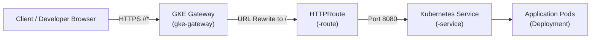

<!-- Copyright (c) 2026 Accenture, All Rights Reserved. -->

# GKE Applications, Ingress Gateway & Networking

This guide covers deploying containerized microservices and web applications on Google Kubernetes Engine (GKE) as part of a Horizon SDV module, including Gateway API routing, health checking, and network security.

---

## 1. Workload Deployment Architecture

In Horizon SDV, applications exposed to developers or external systems are routed through the shared **GKE Gateway** (`gke-gateway`) managed by the platform.



---

## 2. Kubernetes Deployment & Service

Manifest: `gitops/modules/<module-name>/<app-name>/templates/deployment.yaml`

```yaml
apiVersion: apps/v1
kind: Deployment
metadata:
  name: {{ .Values.parentModuleName }}-app
  namespace: {{ .Values.namespace }}
  labels:
    app.kubernetes.io/name: {{ .Values.parentModuleName }}
  annotations:
    argocd.argoproj.io/sync-wave: "2"
spec:
  replicas: 1
  selector:
    matchLabels:
      app.kubernetes.io/name: {{ .Values.parentModuleName }}
  template:
    metadata:
      labels:
        app.kubernetes.io/name: {{ .Values.parentModuleName }}
    spec:
      containers:
        - name: app
          image: {{ .Values.image | default "busybox:1.36" }}
          ports:
            - containerPort: 8080
              name: http
          resources:
            requests:
              cpu: 10m
              memory: 32Mi
            limits:
              cpu: 100m
              memory: 128Mi
          readinessProbe:
            httpGet:
              path: /
              port: 8080
            initialDelaySeconds: 3
            periodSeconds: 10
          livenessProbe:
            httpGet:
              path: /
              port: 8080
            initialDelaySeconds: 10
            periodSeconds: 20
---
apiVersion: v1
kind: Service
metadata:
  name: {{ .Values.parentModuleName }}-service
  namespace: {{ .Values.namespace }}
  labels:
    app.kubernetes.io/name: {{ .Values.parentModuleName }}
  annotations:
    argocd.argoproj.io/sync-wave: "2"
spec:
  type: ClusterIP
  selector:
    app.kubernetes.io/name: {{ .Values.parentModuleName }}
  ports:
    - name: http
      port: 8080
      targetPort: http
```

---

## 3. Gateway API `HTTPRoute` & `HealthCheckPolicy`

Horizon SDV uses Kubernetes Gateway API (`gateway.networking.k8s.io/v1beta1`) and GCP-specific extensions (`networking.gke.io/v1`).

Manifest: `gitops/modules/<module-name>/<app-name>/templates/gateway-route.yaml`

```yaml
apiVersion: gateway.networking.k8s.io/v1beta1
kind: HTTPRoute
metadata:
  name: {{ .Values.parentModuleName }}-route
  namespace: {{ .Values.namespace }}
  labels:
    gateway: gke-gateway
  annotations:
    argocd.argoproj.io/sync-wave: "5"     # Route created after service is ready
spec:
  parentRefs:
    - kind: Gateway
      name: gke-gateway
      namespace: {{ .Values.config.namespacePrefix }}gke-gateway
      sectionName: https
  hostnames:
    - {{ .Values.config.domain }}
  rules:
    - matches:
        - path:
            type: PathPrefix
            value: {{ .Values.rootPath | quote }}
      filters:
        - type: URLRewrite
          urlRewrite:
            hostname: {{ .Values.config.domain }}
            path:
              type: ReplacePrefixMatch
              replacePrefixMatch: /
      backendRefs:
        - name: {{ .Values.parentModuleName }}-service
          port: 8080
---
apiVersion: networking.gke.io/v1
kind: HealthCheckPolicy
metadata:
  name: {{ .Values.parentModuleName }}-healthcheck
  namespace: {{ .Values.namespace }}
  annotations:
    argocd.argoproj.io/sync-wave: "5"
spec:
  default:
    checkIntervalSec: 15
    timeoutSec: 15
    healthyThreshold: 1
    unhealthyThreshold: 2
    logConfig:
      enabled: true
    config:
      type: HTTP
      httpHealthCheck:
        port: 8080
        requestPath: /
  targetRef:
    group: ""
    kind: Service
    name: {{ .Values.parentModuleName }}-service
```

---

## 4. Network Security Policies

When `config.enableNetworkPolicies` is enabled on the platform, all cross-namespace traffic is denied by default. Explicitly allow ingress from the GKE Gateway:

```yaml
{{- if .Values.config.enableNetworkPolicies }}
apiVersion: networking.k8s.io/v1
kind: NetworkPolicy
metadata:
  name: allow-{{ .Values.parentModuleName }}-ingress-from-gateway
  namespace: {{ .Values.namespace }}
  annotations:
    argocd.argoproj.io/sync-wave: "0"
spec:
  podSelector:
    matchLabels:
      app.kubernetes.io/name: {{ .Values.parentModuleName }}
  policyTypes:
    - Ingress
  ingress:
    - ports:
        - protocol: TCP
          port: 8080
{{- end }}
```

---

## 5. Exposing Applications in the Developer Portal

To expose your application in the Developer Portal top navigation or module tab, configure annotations on the child Argo CD `Application` resource in the parent module chart:

```yaml
metadata:
  labels:
    horizon-sdv.io/expose: "true"
  annotations:
    horizon-sdv.io/portal-url: {{ .Values.rootPath | quote }}
    horizon-sdv.io/portal-title: "My App Title"
    horizon-sdv.io/portal-id: "my-app"
```

- `horizon-sdv.io/expose: "true"`: Enables portal visibility when the module is active.
- `horizon-sdv.io/portal-url`: Relative URL path configured in the HTTPRoute (e.g. `/my-app`).
- `horizon-sdv.io/portal-title`: Label displayed in the Developer Portal navigation bar.
