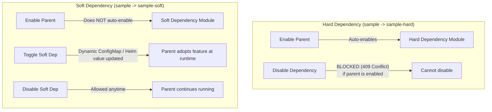

<!-- Copyright (c) 2026 Accenture, All Rights Reserved. -->

# ModuleCatalog Registration & Developer Portal Integration

This guide details how to register new modules in the Horizon SDV **ModuleCatalog**, define dependencies, propagate soft-feature flags, and author Developer Portal documentation.

---

## 1. Registering in `ModuleCatalog`

Module definitions are registered in the singleton `ModuleCatalog` CR located at:
`gitops/apps/module-manager/templates/module-catalog.yaml`

### Example Registration

```yaml
apiVersion: horizon-sdv.io/v1alpha1
kind: ModuleCatalog
metadata:
  name: {{ .Values.catalogCRName }}
  namespace: {{ .Values.namespace }}
spec:
  modules:
    - name: my-module
      path: gitops/modules/my-module
      overviewPath: portal/overview.html
      overviewService: mod-my-module-overview
      overviewServiceNamespace: my-module-app
      autoDisableWhenUnused: true
      hardDependencies:
        - workloads-common
      softDependencies:
        - storage-gcs
      softFeaturesPropagation: HelmValuesAndConfigMap
      softFeaturesConfigMapNamespaces:
        - my-module-app
```

### Field Definitions

| Field | Type | Description |
| :--- | :--- | :--- |
| `name` | string | Unique kebab-case module identifier (e.g. `my-module`). |
| `path` | string | Git repository path to the parent Helm chart (e.g. `gitops/modules/my-module`). |
| `overviewPath` | string | Path within the module chart to the static HTML file (`portal/overview.html`). |
| `overviewService` | string | Kubernetes Service name serving the HTML documentation (`mod-<name>-overview`). |
| `overviewServiceNamespace` | string | Namespace where the overview service runs. |
| `autoDisableWhenUnused` | bool | (Optional) Automatically disable this module when no other enabled module depends on it. |
| `hardDependencies` | []string | Modules required for this module to function. |
| `softDependencies` | []string | Modules that provide optional functionality when enabled. |
| `softFeaturesPropagation` | string | How soft-feature state is passed to workloads: `HelmValues`, `ConfigMap`, or `HelmValuesAndConfigMap`. |
| `softFeaturesConfigMapNamespaces` | []string | Target namespaces where Module Manager should sync the soft-features ConfigMap. |

---

## 2. Hard vs. Soft Dependencies

Horizon SDV supports two dependency models:



### Hard Dependencies
- **Enable**: When the parent module is enabled, Module Manager recursively enables all hard dependencies first.
- **Disable**: A hard dependency cannot be disabled while a dependent parent is enabled (returns `409 Conflict`).
- **Use Case**: Critical base infrastructure or operators (e.g. `storage-gcs` operator required by `sample-data`).

### Soft Dependencies
- **Enable**: Enabling the parent does not force-enable the soft dependency.
- **Disable**: Soft dependencies can be toggled on/off at any time without disrupting the parent.
- **Feature Flags**: When enabled, Module Manager updates Helm values (`softFeaturesEnabled.<name>: true`) and writes a ConfigMap (`horizon-sdv-soft-features-<moduleName>`) into the workload namespaces.
- **Use Case**: Optional integrations (e.g. GCS upload smoke stage in `sample-module`).

---

## 3. Creating the Developer Portal Overview Page

The Developer Portal renders module documentation from `portal/overview.html` served by the in-cluster Nginx micro-deployment.

### Template: `portal/overview.html`

```html
<!DOCTYPE html>
<html lang="en">
<head>
  <meta charset="utf-8"/>
  <title>Module Overview</title>
  <style>
    body {
      font-family: -apple-system, BlinkMacSystemFont, "Segoe UI", Roboto, sans-serif;
      line-height: 1.6;
      color: #334155;
      padding: 1rem;
      margin: 0;
    }
    @media (prefers-color-scheme: dark) {
      body { color: #e2e8f0; }
    }
    h2 { font-size: 1.25rem; font-weight: 600; margin-top: 1.5rem; margin-bottom: 0.5rem; }
    p { font-size: 0.925rem; margin: 0 0 1rem; }
    .badge {
      display: inline-block;
      padding: 0.2rem 0.5rem;
      font-size: 0.75rem;
      font-weight: 600;
      border-radius: 4px;
      background: #e0e7ff;
      color: #4338ca;
      margin-right: 0.5rem;
    }
    .card {
      border: 1px solid #cbd5e1;
      border-radius: 8px;
      padding: 1rem;
      margin-top: 1rem;
      background: rgba(248, 250, 252, 0.5);
    }
  </style>
</head>
<body>
  <div>
    <span class="badge">Version 0.1.0</span>
    <span class="badge">Workload</span>
  </div>

  <h2>About This Module</h2>
  <p>
    This module provides automated pipeline processing, Google Cloud Pub/Sub integration,
    and Developer Portal workflow automation.
  </p>

  <div class="card">
    <h2>Capabilities</h2>
    <ul>
      <li><strong>Event Ingestion:</strong> Pub/Sub topic for streaming telemetry.</li>
      <li><strong>Smoke Testing:</strong> Pre-built Argo Workflow for integration checks.</li>
      <li><strong>Web Dashboard:</strong> Accessible at <code>/my-module</code>.</li>
    </ul>
  </div>
</body>
</html>
```
