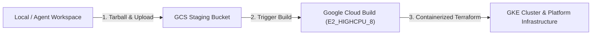

# Reference: Cloud Build Pipeline & SCM Configuration

This document outlines the standard deployment approach using **Google Cloud Build** and clarifies why manual GitHub App setup is not required.

---

## 1. Zero Manual GitHub Setup by Default

Horizon SDV uses a fully automated, cloud-native deployment pipeline via **Google Cloud Build**.

> [!IMPORTANT]
> **Do Not Perform Manual GitHub App Setup**:
> You do **not** need to create a GitHub Organization App, generate RSA private keys, or configure GitHub App installation IDs (`sdv_github_app_id`, `sdv_github_app_install_id`, `sdv_github_app_private_key`).

By default, the platform is configured with:
```hcl
scm_type        = "github"
scm_auth_method = "none"
scm_repo_url    = "https://github.com/GoogleCloudPlatform/horizon-sdv.git"
scm_repo_branch = "main" # or active tracking branch
```
This enables Argo CD to track and synchronize the public repository directly without extra authentication keys or webhooks.

---

## 2. Cloud Build Pipeline Architecture

Instead of relying on local workstation dependencies or complex Git App authentication webhooks, deployment is executed directly on Google Cloud Build workers:



### Key Advantages:
1. **Zero Local Dependencies**: No need to install Terraform, Docker Desktop, or specific CLI versions on your machine.
2. **Deterministic Execution**: Builds execute inside a standardized `ubuntu:24.04` container image containing pinned versions of `terraform`, `gcloud`, and `docker`.
3. **Automated IAM & Workload Identity**: Permissions are managed directly via GCP IAM policy bindings on the Cloud Build service account.

---

## 3. Running Deployments with Cloud Build

All deployment actions are driven via the Cloud Build helper script:

```bash
# Preview changes (Terraform Plan)
./.agents/plugins/horizon-ops/skills/horizon-deploy/scripts/cloud-deploy.sh --plan

# Apply infrastructure (Terraform Apply)
./.agents/plugins/horizon-ops/skills/horizon-deploy/scripts/cloud-deploy.sh --apply

# Destroy infrastructure
./.agents/plugins/horizon-ops/skills/horizon-deploy/scripts/cloud-deploy.sh --destroy

# View build history
./.agents/plugins/horizon-ops/skills/horizon-deploy/scripts/cloud-deploy.sh --status
```
