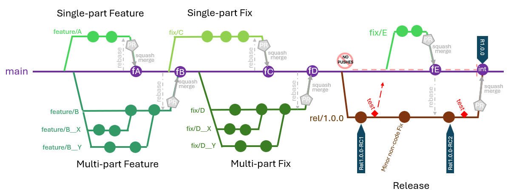
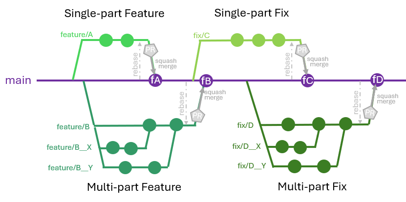
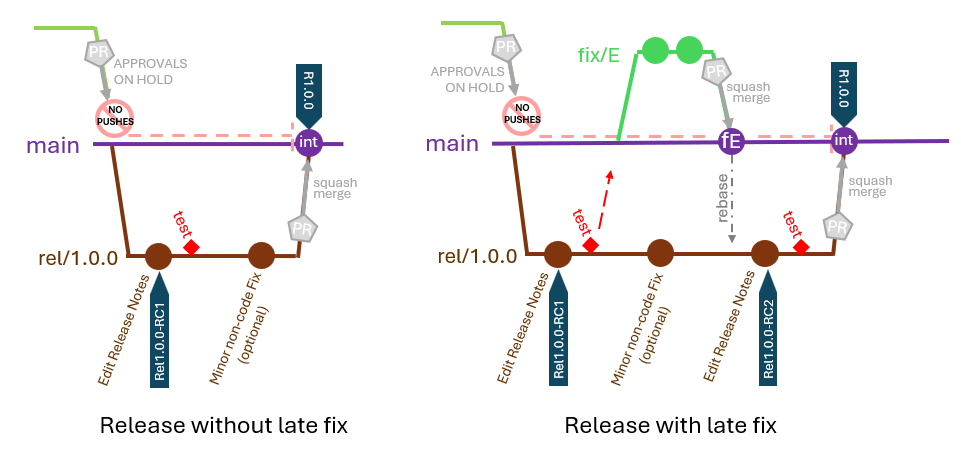

# Git Branching Strategy


## Table of Contents
- [Full Branching Diagram](#full-branching-diagram)
- [General Rules](#general-rules)
- [Feature / Fix Implementation](#feature--fix-implementation)
  - [1. Branch Creation](#1-branch-creation)
    - [Branch Name](#branch-name)
  - [2. Development](#2-development)
  - [3. Testing](#3-testing)
  - [4. Pull Request Completion](#4-pull-request-completion)
    - [PR Contents](#pr-contents)
    - [PR Approval Checks](#pr-approval-checks)
- [Release Process](#release-process)
  - [Release Diagram](#release-diagram)
  - [Release Branch](#release-branch)
  - [Release Tagging](#release-tagging)
  - [Release Procedure](#release-procedure)
    - [PR Approval Checks](#pr-approval-checks-1)
- [Hot Fixes](#hot-fixes)
- [Repo Configuration](#repo-configuration)

---

# Full Branching Diagram:



---

# General Rules:
* All commits across all branches are required to be signed.

---

# Feature / Fix Implementation
Feature and fix implementation can be carried out by internal or external developers using the same process described here (different naming conventions for external contributors - outlined below).

For branching purposes, an epic is considered to be a single “feature”, so all stories within an epic should be treated as parts of the same feature. The epic/feature should only be merged back to `main` branch after all parts have been completed (& tested together).




## 1. Branch Creation:
Each new fix or feature/epic should be developed on a new branch created from `main` branch.
* Where a feature or fix has multiple parts, a sub-branch for each part should be created from the feature branch (see naming convention below).
  * Where an epic has multiple stories, they do not necessarily need to be treated as independent parts requiring a sub-branch each; if they are each small changes, they can be developed on the same branch.
* When branching from main, ensure that it is first up to date with origin/main
  ```
    git fetch origin
    git checkout main
    git pull
    ```


### Branch Name:
| **Name** | **Internal or External Developer:** | **Single or Multiple Parts:** | **Detail:** | **Examples:** |
| :--- | :--- | :--- | :--- | :--- |
| `feature/<A>` or `fix/<A>` | Internal | Single | `A = <ticketID>-<title>` | <ul><li>`feature/TAA123-CustomBuildManifest`</li><li>`fix/TAA124-BuildManifestError`</li></ul> |
| `feature/<A>__<X>` or `fix/<A>__<X>` | Internal | Multiple | `A = <ticketID>-<title>`<br>`X = <subticketID>-<subtitle>` | <ul><li>`feature/TAA123-CustomBuildManifest__TAA124-ParamCreation`</li><li>`feature/TAA123-CustomBuildManifest__TAA125-DocsUpdate`</li></ul> |
| `contrib/feature/<A>` or `contrib/fix/<A>` | External | Single | `A = <title>` | <ul><li>`contrib/feature/CustomBuildManifest`</li><li>`contrib/fix/BuildManifestError`</li></ul> |
| `contrib/feature/<A>__<X>` or `contrib/fix/<A>__<X>` | External | Multiple | `A = <title>`<br>`X = <subtitle>` | <ul><li>`contrib/feature/CustomBuildManifest__ParamCreation`</li><li>`contrib/fix/CustomBuildManifest__DocsUpdate`</li></ul> |

* **Title** should concisely describe the fix or feature/epic. **Subtitle** should concisely describe the part/story.
* For branches with multiple parts, `__` is used to delineate the parts (e.g. `feature/A__X`). `/` cannot be used (e.g. `feature/A/X`) because git does not allow branches whose name contains the name of another branch.

Branch Creation Example: `git checkout -b feature/TAA123-CustomBuildManifest`

## 2. Development:
* **Rebase encouraged:** Developers can rebase their feature or fix branch against `main` branch at any time during development.
* **Early Pull Request:** It is recommended that a Pull Request be opened in GitHub w.r.t `main` branch as early as is practical; the state should be set to “draft” until final testing has been performed and approval is being sought (during creation, use the "Create draft pull request option" or, after creation, click on “Ready to merge” and then click on “Convert to draft”).
  * See [PR Contents](#pr-contents) below for what is required in the PR description.

## 3. Testing:
**Pre-requisites:**
* **Single branch:** For multi-part features / fixes, all sub-branches have been merged back to the main feature / fix branch. Whether a PR is used for these merges should be decided by the team working on a particular feature or fix.
* **Rebase against main:** A rebase of the feature/fix branch against `main` has been performed before final testing is done; this is to ensure that final testing is done on exactly what will be present on `main` after the final push.

**Test Environment:** Full feature testing should be carried out on each feature/fix branch on a deployed instance.

**Testing Evidence:** Evidence of tests carried out should be collated during the testing process.

## 4. Pull Request Completion:
When a feature/epic or fix has been fully developed and tested, the following operations should be carried out:

1. Open a **Pull Request** in GitHub (if not already open) and ensure it meets the following requirements:
   * Description as per the [PR Contents](#pr-contents) table below.
   * Review requested from:
     * At least 1 person from the Code Owners team
     * At least 1 person from the Release Manager team
     * At least 1 other person who will review the functioning of the feature/fix itself.
   * The merge status of the PR is *“No conflicts with base branch”* or *“Ready to Merge”* — rebase (and retest) may be required if not.
2. Set the status of the **Pull Request** to *Ready for Review*.
   * *Note:* If PR is submitted during release testing, it may not be approved until after the release is completed, in which case you will need to rebase again before approval is granted. Approval of features/fixes during the release process is only done in exceptional circumstances.
3. Wait for approval (see [PR Approval Checks](#pr-approval-checks) below).
4. Member of Release Manager team performs the actual merge to `main` via GitHub’s **Squash Merge\*** option.
5. **Delete** feature/fix branch.

> **\*NOTE:** In exceptional circumstances, it may be preferable for a feature/fix branch to be pushed as more than 1 commit (if the feature/fix contains a change not strictly tied to the feature/fix); in this case, the Release Manager should ensure that all commits tied to the feature/fix have been squashed into a single commit (with commit message matching the expected PR Main Description as below) and all commits relating to the “separate” change are squashed into a single commit with adequate commit message. When this has been done and the PR has been approved, the Release Manager can override the usual Squash Merge requirement and merge via GitHub’s **Rebase Merge** option. This will result in 2 commits pushed to `main`.

### PR Contents: 
> **IMPORTANT:** The PR Title and Description will be used as the commit message for the full feature/fix on `main`, so care should be taken when compiling it.

| **Item:** | **Location:** | **Extra Notes:** | **Required:** |
| :--- | :--- | :--- | :--- |
| PR Title | Title | Title of feature/fix.<br>* For internal team, include ticket ID | always |
| Purpose of feature/fix | Main Description | Main aim of the feature/fix | always |
| Concise Description | Main Description | Should be concise - succinctly including all relevant details | always |
| Dependencies | Main Description | Any hard/soft dependencies of the feature/fix | if applicable |
| Open Source Component Changes | Main Description | If any Open Source components have been added/updated/modified, they need to be listed with details of the change outlined (including reason). | if applicable |
| Testing | Comment | Detail of what was tested, outcomes and evidence | always |
| Suggested Release Note | Main Description | May borrow from “Purpose” and “Description” field | always |

*Note: A PR template for the Main Description field will be provided as default in GitHub (see [here](github_configuration.md#pr-template). 

### PR Approval Checks:
**Non-functional checks** to be performed by the Release Manager to ensure compliance with process requirements not enforced by GitHub rules:
1. Ensure the PR Title correctly identifies the feature or fix.
2. Ensure the PR Description meets all requirements as outlined in the [PR Contents](#pr-contents) table above.
3. Ensure that the combination of PR title and description constitutes an acceptable commit message for the eventual push to `main`, with any template instructions removed.
4. Ensure that the merge status of the PR is *“No conflicts with base branch”*.
5. Check branch is current and contains all commits already on `main` (i.e. rebase was already done).
6. Review any OS Component Changes for licensing conflicts.
7. Ensure copyright headers are present.
8. Ensure that release process is not in progress (new features/fixes are not to be pushed during this process).

**Functional checks** to be performed by other reviewer listed in PR:
* Full review of all changes.
* Check that coding standards are followed.
* Ensure that adequate testing of the feature/fix was done on rebased code on a deployed instance.
* Review testing evidence.
* Verify that adequate documentation is included (if required).

---

# Release Process

## Release Diagram:



## Release Branch:
When all features/fixes required for a release are finished and pushed to `main` branch, a release branch `rel/<X>.<Y>.<Z>` is created by the Release Manager.

| Branch type | Naming pattern | Created from | Example |
| :--- | :--- | :--- | :--- |
| Release | `rel/<X>.<Y>.<Z>` | `main` | `rel/1.0.0` |

* `X` is the major version
* `Y` is the minor version
* `Z` is the patch version

## Release Tagging:
| **Tag Type** | **Branch** | **Pattern** | **Example** |
| :--- | :--- | :--- | :--- |
| Release Candidate | release branch `rel/*` | `Rel<X>.<Y>.<Z>-RC<N>` | `Rel1.0.0-RC1` |
| Release | `main` | `R<X>.<Y>.<Z>` | `R1.0.0` |

## Release Procedure:
> **IMPORTANT:** No changes are allowed to be pushed to the `main` branch while the release branch is operational. Any late fixes which need to be pulled into the release branch (so that they can be included in the release) are strictly controlled by the Release Management team.

The following release tasks are carried out on the release branch:
1. **Tag Release Candidate** — `Rel<X>.<Y>.<Z>-RC<N>` — to be done before each formal test run (e.g. `Rel1.0.0-RC1`).
2. **Release Testing**
3. **Edits**
   * Superficial edits (e.g. release notes, documentation updates, minor non-code fixes) can be made directly on the release branch.
   * *Late Fix:* A substantial fix for an issue found in testing is treated as a *Late Fix*.
     * Follow the usual [feature/fix procedure](#feature--fix-implementation).
     * After merging the fix branch to `main` branch, a rebase against `main` needs to be performed on the release branch (`rel/<X>.<Y>.<Z>`).
     * Release tasks (tagging & testing) may need to be restarted or adjusted accordingly.
4. Repeat steps 1, 2, and 3 as necessary (i.e. if a *Late Fix* was made).
5. Raise a **Pull Request** in GitHub against `main` branch:
   * PR Description should include:
     * Relevant release details
     * Brief outline of the features/fixes included in the release
     * Details of any minor fixes included in release branch (Note: details of any *Late Fixes* will be contained in their own commit messages)
   * Pull Request should be assigned to:
     * 1 member of the Code Owners team
     * 2 members of the Release Manager team
   * Wait for PR approval.
6. Release Manager **merges** to `main` using GitHub’s **Squash Merge** option.
7. **Delete** release branch.
8. **Tag Release:** `R<X>.<Y>.<Z>` (e.g. `R1.0.0`).

### PR Approval Checks:
* Code review of any minor fixes made on release branch.
* Review of release notes — must contain a synopsis on each of the features/fixes included in the release.

---

# Hot Fixes
Hot fixes onto `main` branch are not allowed. All fixes should be carried out using the branching process already outlined for features/fixes.

---

# Repo Configuration
For repo config see separate document [here](github_configuration.md).

---
