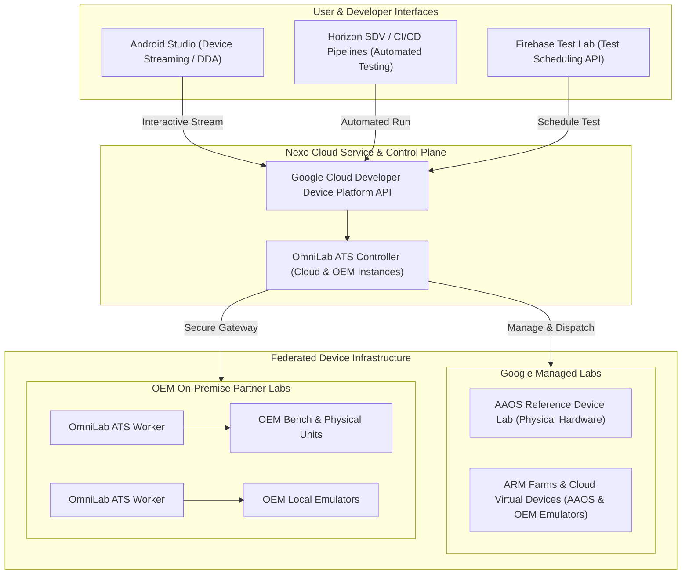

# Project Nexo: Scalable AAOS Testing Engine for Horizon SDV

Introduced at Google Automotive Partner Bootcamp (GAPB) 2026, **Project Nexo**
is an advanced, reliable, and scalable lab infrastructure program designed to
transform Android Automotive OS (AAOS) development and testing. By bridging the
gap between global developers and fragmented hardware environments, Nexo
provides continuous, secure, and on-demand access to both physical automotive
hardware and high-fidelity cloud virtual devices.

## Overview

Powered by **OmniLab ATS (Android Test Station)**, Nexo serves as the core
**testing engine** for [Horizon
SDV](https://github.com/GoogleCloudPlatform/horizon-sdv/) (Google Cloud's open
Software-Defined Vehicle platform). It enables automotive partners, OEMs, Tier 1
suppliers, SoC vendors, and third-party (3P) app developers to execute automated
CI/CD workflows and interactive development against real and virtual automotive
targets from anywhere in the world.

**Summary:** Project Nexo establishes a decentralized, federated lab
infrastructure that connects developer IDEs and automation pipelines to physical
bench hardware and cloud virtual devices, eliminating hardware bottlenecks and
accelerating AAOS validation cycles.

## The Challenge in Automotive Validation

As automotive software adoption accelerates, development and test engineering
teams face critical operational hurdles:

*   **Limited Access to Physical Hardware:** Global development teams and 3P app
    creators often struggle to access physical AAOS reference hardware, custom
    head units, or bench environments, leading to bottlenecks and siloed
    development.
*   **Slow Validation Cycles:** Reliance on manual testing processes and
    localized test setups prolongs feedback loops and delays software
    integration.
*   **Onboarding Complexity:** High friction and security overhead when
    onboarding external partners (SoCs, Tier 1s, algorithm developers) to
    proprietary internal hardware lab environments.
*   **The Scaling Challenge:** Scaling test coverage across an ever-expanding
    diversity of OEM-specific virtual devices and physical head units while
    avoiding late-stage launch exceptions.

**Warning:** Lack of early validation against target OEM hardware often results
    in late-stage integration failures and launch exception requests. Shift-left
    testing with Nexo addresses this bottleneck directly.

## What is Project Nexo?

Project Nexo establishes a unified, decentralized lab infrastructure that
connects developers directly to automotive test targets in the cloud and in
on-premise partner labs.

### Key Architectural Pillars

1.  **Powered by OmniLab ATS (Android Test Station):** At the core of Nexo is
    OmniLab ATS — an enterprise-grade test automation and lab management
    infrastructure. ATS is responsible for managing device inventory on host
    machines, scheduling and dispatching test suites (such as CTS, GTS, and
    custom automotive tests), handling automated device recovery, and
    communicating securely with cloud interfaces.

2.  **Decentralized Lab Federation:**

    *   **Google-Managed Labs:** High-scale infrastructure hosting AAOS
        reference devices (API Levels 32 through 34+) and cloud virtual devices
        (ARM farms and emulators) maintained by Google.
    *   **OEM Hosted Partner Labs:** OEMs and Tier 1 partners can host physical
        head units and custom emulators within their own secure on-premise lab
        space. Through OmniLab ATS workers deployed in the partner network,
        these devices seamlessly connect to the unified testing ecosystem
        without compromising corporate network security.

3.  **Fractional Device Scheduling & Sharing:** Nexo intelligently allocates
    device time, allowing hard-to-obtain physical hardware and cloud instances
    to be dynamically shared between scheduled automated regression runs and
    ad-hoc interactive developer sessions.

**Note:** OmniLab ATS worker nodes communicate outbound to the controller,
    ensuring that OEMs maintain complete firewall and network isolation for
    their proprietary bench hardware.

## Core Capabilities & Use Cases

### 1. Direct Device Streaming in Android Studio (DDA)

Developers can connect to remote AAOS reference devices and OEM virtual/physical
head units directly inside Android Studio.

*   **Instant Onboarding:** Access real hardware or virtual devices remotely
    from any IDE without complex local bench setup.
*   **Interactive Debugging:** Perform real-time touch streaming, logcat
    inspection, profiling, and interactive UX testing as if the device were
    plugged into the local workstation.

### 2. Automated CI/CD via Firebase Test Lab (FTL) & Cloud APIs

Nexo exposes robust cloud APIs and integrates natively with Firebase Test Lab
and standard continuous integration pipelines.

*   **Automated Validation:** Schedule and execute automated end-to-end test
    suites across a matrix of physical and virtual automotive targets upon every
    PR or nightly build.
*   **Reduced Time-to-Market:** Automated CI/CD verification accelerates
    validation cycles and catches regressions early in the development loop.

### 3. Shift-Left Validation for 1P & 3P Ecosystems

*   **OEMs & Tier 1s:** Test early and often on high-fidelity virtual devices
    and lab hardware, eliminating the need for launch exception requests and
    ensuring rock-solid system stability.
*   **App Developers:** The third-party app ecosystem can validate
    compatibility, responsiveness, and driver-distraction compliance across
    diverse OEM display form factors and system images well ahead of vehicle
    deployment.

## Integration with Horizon SDV

[Horizon SDV](https://github.com/GoogleCloudPlatform/horizon-sdv/) is Google
Cloud's open-source Software-Defined Vehicle platform, providing cloud-native
development frameworks, containerized automotive runtimes, and vehicle service
abstractions.

Project Nexo serves as the dedicated **Testing Engine for Horizon SDV**,
delivering unified validation across software simulation and hardware execution:

| Feature | Horizon SDV + Nexo Integration Benefit |
| :--- | :--- |
| **Unified Test Engine** | Horizon developers trigger Nexo test executions directly from Horizon development pipelines, CLI tools, and automated workflows. |
| **HIL & VIL Parity** | Maintain seamless test parity across Virtual-in-the-Loop (cloud emulators) and Hardware-in-the-Loop (physical bench units in OEM labs). |
| **Automated Benchmarks** | Perform continuous compatibility, performance, and API verification against AAOS vehicle HALs (VHAL) and infotainment services. |
| **Scalable Partner Loop** | Enables automotive partners building on Horizon to seamlessly connect their existing on-premise test rigs into their cloud-native SDV workflows. |

**Best practice:** When constructing Horizon SDV continuous integration
workflows, configure automated smoke tests against Cloud Virtual Devices on
every PR, and schedule full hardware-in-the-loop regression suites against OEM
physical bench units on nightly builds.

## Joining the Nexo Early Access Program (EAP)

The **Nexo Early Access Program (EAP)** is open to automotive partners seeking
to accelerate their AAOS development and validation infrastructure.

**Tip:** By joining the Nexo EAP, partners can scale test infrastructure
internally with enterprise-grade OmniLab ATS tooling while granting internal and
external developers push-button access to virtual and physical reference
devices.

### Get Started

*   **Horizon SDV Repository:** Explore the platform and testing integration at
    [github.com/GoogleCloudPlatform/horizon-sdv](https://github.com/GoogleCloudPlatform/horizon-sdv/).
    *   **Partner Engineering Contact:** Reach out to your dedicated Google
        Automotive Partner Engineering representative to request Nexo EAP
        onboarding and lab deployment guides.
*   **Feedback & Support:** Provide feedback or report issues via the internal
    Automotive Partner Tracker or your designated support channels.
